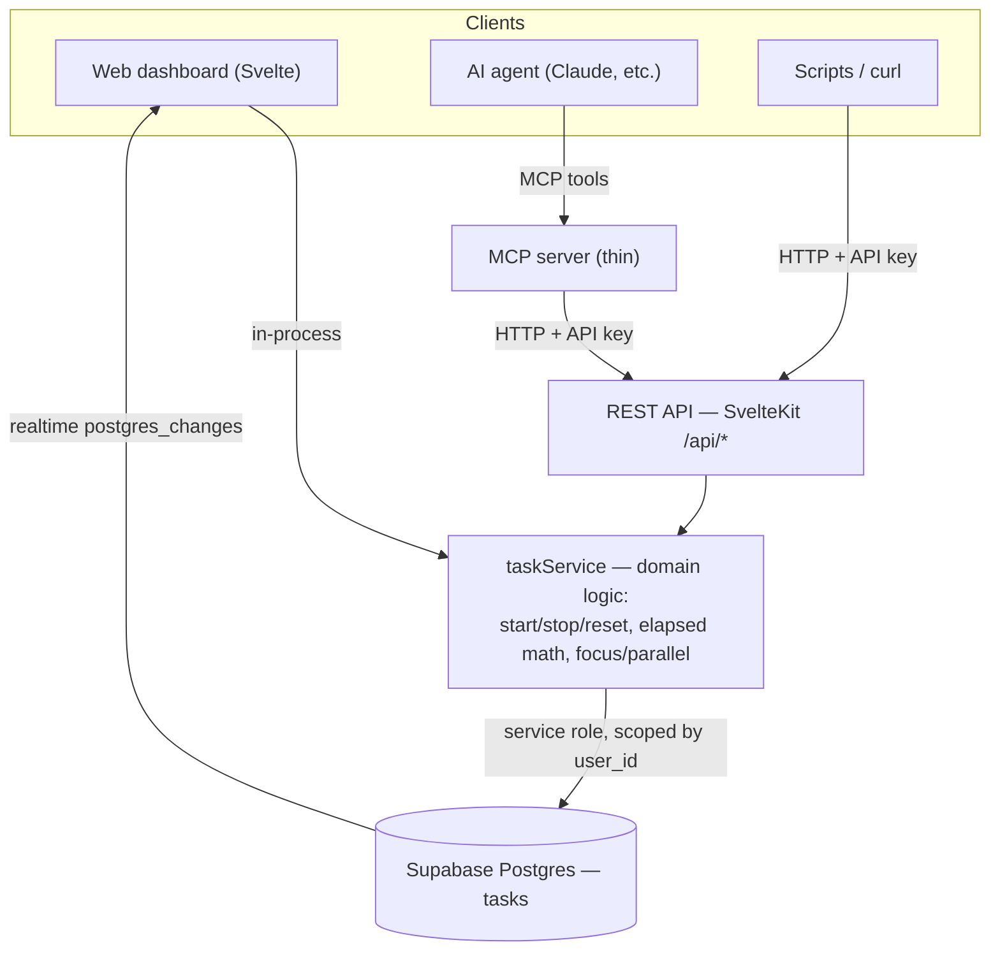

# AI-Controllable Timer — Architecture

Status: **Partially implemented** · Last updated: 2026-07-18

> **Update — local SQLite cutover.** The backend has moved off Supabase to a
> local **SQLite** database (Drizzle ORM, `better-sqlite3`). Auth is now
> session-cookie based (argon2 + a `sessions` table) instead of Supabase Auth;
> the API authenticates a request by **session cookie (browser) or `Bearer` API
> key (agents)**. Live updates use **SSE** (`/api/stream`) instead of Supabase
> realtime. The layered design below still holds — only the storage/auth/realtime
> implementations changed. Sections mentioning Supabase/RLS/`mint_api_key` are
> historical; see the updated setup steps under [Using the API](#using-the-api-phase-1).

This document sketches how an AI agent (Claude, or any other) can drive the Task
Timer — create tasks, start/stop timers, adjust time, export reports — so a user
can have work tracked automatically while working alongside agents.

## TL;DR

- The **web app already subscribes to Supabase realtime** (`postgres_changes` on
  `tasks`). Anything that writes to the `tasks` table makes every open dashboard
  update live. So the "AI control surface" is not about rendering — it is a
  **safe, per-user way to mutate tasks**.
- Recommended shape: a small **domain service** (`taskService`) that owns the
  timer rules, exposed through a **REST API** (universal) and an **MCP server**
  (AI-native). Agents talk MCP; scripts/curl talk REST; the web UI calls the
  service in-process. All three share one implementation, so behavior never
  drifts.
- Agents authenticate with **per-user API keys** (revocable, hashed), never the
  Supabase service role.
- Targets the **web/Supabase** app only. The desktop app is local-only
  (`localStorage`) and can't be driven remotely until it also syncs to Supabase.

## Why not just give the agent a Supabase key?

Tempting (least code), but rejected:

- **Domain rules live in the client today.** Focus-mode "stop the others",
  `start_time`/`elapsed_time` accumulation, and total-time math are implemented
  inside `apps/web/src/routes/dashboard/+page.svelte`. If an agent writes to the
  DB directly, its behavior drifts from the UI's.
- **Blast radius.** A leaked service/anon key is hard to scope and revoke per
  agent. RLS becomes the *only* guardrail.
- **No audit / rate limiting** at the row level.

So we put a thin service in front and hand agents scoped keys instead.

## Architecture



The **`taskService`** is the crux. Extract the timer logic out of the Svelte
component into a server-callable module that both the dashboard and the API use.
One source of truth → the agent can never desync from the UI.

## Control surface

Operations (service methods; REST and MCP mirror these one-to-one):

| Operation | REST | Notes |
|---|---|---|
| `listTasks()` | `GET /api/tasks` | returns tasks + computed elapsed + total |
| `createTask(label, description?)` | `POST /api/tasks` | |
| `startTimer(taskId, exclusive?)` | `POST /api/tasks/:id/start` | `exclusive` defaults to the user's timer mode |
| `stopTimer(taskId)` | `POST /api/tasks/:id/stop` | accumulates elapsed, clears `start_time` |
| `resetTask(taskId)` | `POST /api/tasks/:id/reset` | |
| `resetAll()` | `POST /api/tasks/reset-all` | |
| `updateTask(taskId, fields)` | `PATCH /api/tasks/:id` | `label`, `description`, `elapsed_seconds` |
| `deleteTask(taskId)` | `DELETE /api/tasks/:id` | |
| `setTimerMode(mode)` | `PUT /api/settings/timer-mode` | `"focus"` \| `"parallel"` |
| `getReport(format)` | `GET /api/report?format=markdown\|csv` | reuse existing formatters |

MCP tools wrap the same set, e.g. `start_timer`, `create_task`,
`start_working_on` (a Phase-3 convenience: create-or-find then start).

### Example (REST)

```http
POST /api/tasks/42/start
Authorization: Bearer sk_live_9f3c...
Content-Type: application/json

{ "exclusive": true }
```
```json
{ "id": 42, "label": "Write RFC", "is_running": true,
  "elapsed_seconds": 5400, "start_time": "2026-07-18T09:12:00Z" }
```
The write lands in Supabase → the user's open dashboard reflects it within ~1s via
realtime.

## Three decisions to nail first

### 1. Auth: per-user API keys (not the service role)

New table:

```sql
create table api_keys (
  id           uuid primary key default gen_random_uuid(),
  user_id      uuid not null references auth.users(id) on delete cascade,
  key_hash     text not null,            -- sha256 of the key; never store raw
  key_prefix   text not null,            -- e.g. "sk_live_9f3c" for display
  name         text,
  scopes       text[] default '{tasks:read,tasks:write}',
  revoked      boolean default false,
  last_used_at timestamptz,
  created_at   timestamptz default now()
);
create index on api_keys (key_hash) where revoked = false;
```

Flow: agent sends `Authorization: Bearer <key>` → server hashes it → looks up a
live row → resolves `user_id` → **scopes every query by that `user_id`**. The
server uses the service role internally but never exposes it. Keys are shown once
at creation, are revocable, and record `last_used_at`. RLS stays enabled as
defense-in-depth.

### 2. Promote timer mode to the server

Today `timerMode` is per-device `localStorage`, invisible to the agent. Move it to
a per-user setting so UI and agent agree:

```sql
create table user_settings (
  user_id    uuid primary key references auth.users(id) on delete cascade,
  timer_mode text not null default 'focus',   -- 'focus' | 'parallel'
  updated_at timestamptz default now()
);
```

`startTimer` uses this as the default for `exclusive`, overridable per call.

### 3. Reuse existing infrastructure

- **`webhooks` table** (already present, encrypted URLs) → outbound events:
  notify when a timer starts/stops, or when total time crosses 8h. Great for
  "the agent started a task" alerts.
- **`view_links` table** → read-only status for an agent without issuing a key.
- **`packages/shared`** already holds `formatTime` and the `Task` types — put the
  pure elapsed/format helpers there; keep Supabase mutations in the server
  service.

## Security checklist

- API keys hashed at rest; raw key shown once.
- Every request scoped to the key's `user_id`; RLS on as a second layer.
- Per-key scopes (`tasks:read` / `tasks:write`) and revocation.
- Rate limiting on `/api/*`.
- Audit via `last_used_at` (and optionally a request log).
- Service role key stays in server env only; never sent to the agent or client.

## Phasing

- **Phase 0 — Refactor (no behavior change).** Extract `taskService` from the
  dashboard; move timer mode to `user_settings`. Dashboard calls the service.
  Foundation for everything else. *(Recommended first step.)*
- **Phase 1 — REST API + `api_keys`.** ✅ *Implemented* — see
  [Using the API](#using-the-api-phase-1) below. (Key issuance is CLI/SQL for now;
  a settings-page UI is still open.)
- **Phase 2 — MCP server.** Thin wrapper over the REST API exposing tools; point
  Claude/agents at it. Now it's AI-native.
- **Phase 3 — Intent + notifications.** Higher-level tools (`start_working_on`),
  webhook events, and eventually a fully-autonomous loop (voice / computer-use).

## Open questions

- **Key issuance UX** — a "Settings → API keys" page in the web app, or CLI-only
  at first?
- **MCP hosting** — run the MCP server as a separate small service, or embed via a
  SvelteKit route? (Separate service keeps concerns clean.)
- **Concurrency** — if the agent and the user both start timers in focus mode,
  last-write-wins is fine, but worth confirming.
- **Desktop unification** — should the desktop app switch to Supabase-backed
  storage when signed in, so it's controllable too? (Larger change.)

## Using the API (Phase 1)

Implemented endpoints (all require `Authorization: Bearer <key>`, JSON in/out):

| Method | Path | Scope | Body |
|---|---|---|---|
| GET | `/api/tasks` | `tasks:read` | — |
| POST | `/api/tasks` | `tasks:write` | `{ label, description? }` |
| POST | `/api/tasks/:id/start` | `tasks:write` | `{ exclusive? }` |
| POST | `/api/tasks/:id/stop` | `tasks:write` | — |
| GET | `/api/settings/timer-mode` | `tasks:read` | — |
| PUT | `/api/settings/timer-mode` | `tasks:write` | `{ timer_mode }` |

Endpoints also exist to manage keys and reset/update/delete/reorder tasks:
`POST/GET /api/keys`, `DELETE /api/keys/:id`, `POST /api/tasks/:id/reset`,
`POST /api/tasks/reset-all`, `PATCH/DELETE /api/tasks/:id`, `POST /api/tasks/reorder`.
Live updates: `GET /api/stream` (SSE, session cookie).

**Setup (local SQLite)**
1. Apply migrations: `pnpm --filter sv-task-timer db:migrate` (creates/updates
   `local.db`; path configurable via `DATABASE_PATH`, see `.env.example`).
2. Register a user in the app (`/register`) and sign in.
3. Mint a key — either in the browser console while logged in, or via any
   session-authenticated client (returns the raw key **once**):
   ```js
   await fetch('/api/keys', {
     method: 'POST',
     headers: { 'content-type': 'application/json' },
     body: JSON.stringify({ name: 'claude-agent' })
   }).then((r) => r.json()); // => { key: "sk_live_…", … }  (store it; only its hash is kept)
   ```
   Key management requires a logged-in **session** — an API key cannot mint more keys.

**Examples**
```bash
KEY=sk_live_...
BASE=https://your-app.example.com

curl -H "Authorization: Bearer $KEY" $BASE/api/tasks

curl -X POST -H "Authorization: Bearer $KEY" -H 'Content-Type: application/json' \
  -d '{"label":"Write RFC"}' $BASE/api/tasks

curl -X POST -H "Authorization: Bearer $KEY" $BASE/api/tasks/42/start
curl -X POST -H "Authorization: Bearer $KEY" $BASE/api/tasks/42/stop
```

Any write lands in Supabase → the user's open dashboard reflects it within ~1s
via realtime. Revoke a key with `update api_keys set revoked = true where id = …`.

**Not yet done in this slice:** reset/reset-all/update/delete endpoints, a report
endpoint, rate limiting, a key-management UI, and adopting the shared timer math
inside the dashboard (the UI still uses its own copy). Tracked for the next pass.

## Related code

- REST API: `apps/web/src/routes/api/**`, guard `apps/web/src/lib/server/auth.ts`,
  domain `apps/web/src/lib/server/taskService.ts`.
- Pure timer math: `packages/shared/src/timer.ts`.

- Timer logic to extract: `apps/web/src/routes/dashboard/+page.svelte`
  (`toggleTimer`, `startTimer`, `stopTimer`, `resetTimer`, `getCurrentElapsedTime`).
- Schema & RLS: `apps/web/supabase/migrations/`.
- Shared helpers/types: `packages/shared/src/`.
