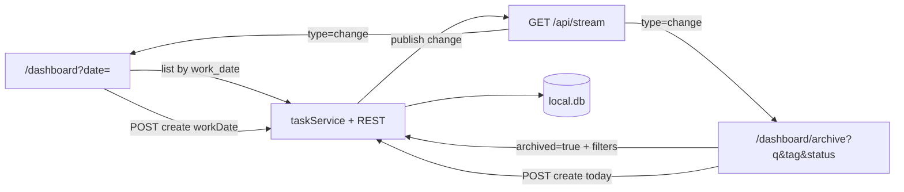

# E7 — Web Dashboard Parity: implementation plan

**Status:** Ready to implement  
**Epic:** [epics.md](./epics.md) E7 · **Checklist:** [tasks.md](./tasks.md)  
**Last updated:** 2026-09-10

TUI is the reference UX. This epic makes the SvelteKit dashboard match daily workflow, create/dedup rules, extended fields, archive, and live refresh. MCP stays a thin HTTP client — only optional `workDate` on create if we expose it.

---

## What's already shipped

| Area | State |
|------|--------|
| Daily load by `?date=` | Done — `dashboard/+page.server.ts` defaults to local today, filters via `listTasks(user.id, workDate)` |
| Date bar (prev / `<input type="date">` / next / Today) | Done — bookmarkable `goto('/dashboard?date=YYYY-MM-DD')` |
| Archive **API** | Done — `GET /api/tasks?archived=true&q&tag&status` (TUI rules: unfinished, not archived/deleted/completed/cancelled) |
| Extended fields **API** | Done — `TaskDTO` + `POST/PATCH` Zod already accept `code`, `link`, `status`, `notes`, `tags` |
| SSE **server** | Done — `GET /api/stream` emits `{ type: 'change', entity, taskId }`; `publish()` already fires on task / comment / integration |
| MCP list filters | Done — `list_tasks` already forwards date/q/tag/status/done/archived |

## Gaps that still fail acceptance

1. **Create ignores TUI dedup.** `createTask` always `INSERT`s for calendar today. Unique index `(user_id, work_date, label)` will throw on a same-day duplicate instead of returning the existing row. No copy of description from the most recent same-label row.
2. **Create ignores the viewed day.** Dashboard `addTask` posts `{ label }` only. Creating while looking at yesterday still writes *today*. Position is `COUNT(*)` of all user tasks, not `MAX(position)+1` for that day (TUI).
3. **Extended fields have no UI.** Edit modal is title / description / time. Cards don't show code, status, or tags. Local `TaskDTO` in `+page.svelte` omits the new fields.
4. **No archive page.** `apps/web/src/routes/dashboard/archive/` does not exist. No daily ↔ archive nav.
5. **SSE client listens for the wrong event.** Handler checks `payload.type === 'tasks-changed'`; server sends `type: 'change'`. Live refresh never runs. `docs/api.md` documents the old name.

Known TUI/web timer mismatch (include in Wave 1, small): `resetAll()` zeros **every** task for the user. TUI `reset_all` is scoped to the viewed `work_date`. Scope web reset to the viewed day so daily totals stay comparable.

Out of scope: Svelte 5 runes rewrite, JIRA/Bitbucket panels, comments UI, MCP new tools.

---

## Target behavior (match TUI)

Port of `apps/tui/src/db/tasks.rs` `create_task` / `list_archive` / `continue_today`:

```text
create(label, workDate, description?):
  trim label; reject empty
  if row exists for (user, workDate, label) → return it unchanged
  if description empty/missing → copy from latest same-label row
      WHERE description IS NOT NULL AND description != ''
      ORDER BY work_date DESC, id DESC LIMIT 1
  else use caller description
  INSERT with position = MAX(position)+1 for (user, workDate)
  (web only) jira.onCreate runs only on insert, never on the existing-row path

continue today (archive):
  POST create { label, description } with workDate = calendar today
  then navigate to /dashboard (today)
  same-day duplicate → existing today's row (no second insert)
```

Archive list (already in `listTasks`): `done=false`, `is_archived=false`, `is_deleted=false`, `is_completed=false`, `is_cancelled=false`, order `work_date DESC, position ASC`. Filters: label substring `q`, tag substring, optional exact `status`.

---

## Architecture



Keep dashboard in **existing Svelte 4 syntax** (`export let`, `on:click`, `$:`). Do not mix a runes migration into this epic. New files follow the same style as `dashboard/+page.svelte` and `keys/+page.svelte`.

Extract only what archive and daily both need:

| File | Role |
|------|------|
| `apps/web/src/lib/dates.ts` | `todayISO()`, `shiftDate(iso, days)`, `isISODate()` — no `$env` |
| `apps/web/src/lib/components/TaskEditModal.svelte` | Edit fields including extended |
| `apps/web/src/routes/dashboard/archive/+page.svelte` | New page |
| `apps/web/src/routes/dashboard/archive/+page.server.ts` | Load + URL filters |

Leave the 800-line daily page in place; add fields and an Archive link rather than splitting the whole timer UI.

---

## Wave 1 — Dedup + workDate + tests + SSE client

**Blocks everything else.** No visual change except live refresh starting to work.

### 1a. `createTask` parity

File: `apps/web/src/lib/server/taskService.ts`

```ts
export interface TaskCreate {
  label: string;
  description: string | null;
  workDate?: string; // YYYY-MM-DD; default todayISO()
  code?: string | null;
  link?: string | null;
  status?: string;
  notes?: string | null;
  tags?: string[] | null;
}
```

Algorithm (same SQL as TUI):

1. `workDate = input.workDate ?? todayISO()`
2. Select existing `user_id + work_date + label` → return `toDTO` **without** `publish` / JIRA
3. If no description, copy latest non-empty description for that label (any day)
4. `position = (MAX(position) WHERE user_id AND work_date) + 1`, or `0`
5. Insert remaining fields; `jira.onCreate` then `publish({ entity: 'task', action: 'create' })`

Also:

- `resetAll(userId, workDate?: string)` — if date given (dashboard always passes viewed date), `WHERE user_id AND work_date`. API: optional `?date=` or body; dashboard already knows `workDate`.
- `POST /api/tasks` Zod: optional `workDate: z.string().regex(/^\d{4}-\d{2}-\d{2}/)`. MCP omit → today. Dashboard and archive pass it explicitly.

### 1b. Unit tests

Web has **no test runner**. Add Vitest in `apps/web` only:

- `pnpm --filter sv-task-timer add -D vitest`
- `vite.config.ts`: `test: { include: ['src/**/*.test.ts'], environment: 'node' }`
- script: `"test": "vitest run"`

Do **not** import `taskService.ts` directly (it pulls `$env` + real `local.db`). Extract insert/dedup into a db-parameterized helper, e.g. `createTaskRow(db, userId, input)` in `taskService.ts` or `taskCreate.ts`, and test that against drizzle + `better-sqlite3(':memory:')` with the `tasks` / `users` schema (or a trimmed CREATE TABLE matching TUI's test setup).

Mirror TUI tests in `apps/tui/src/db/tasks.rs`:

| Test | Assert |
|------|--------|
| `create_same_label_same_day_returns_existing` | same id; description stays first; list length 1 |
| `create_same_label_new_day_copies_description` | new row; description copied; `workDate` is the new day |
| `create_same_label_new_day_keeps_caller_description` | supplied description wins |
| `create_position_is_per_day` | second task on a day gets `position = 1` even if other days exist |

### 1c. SSE client + docs

In `dashboard/+page.svelte`:

```ts
if (payload.type === 'change') scheduleRefresh();
```

`refresh()` already uses `/tasks?date=${workDate}` — keep that.

Update `docs/api.md` Live updates section: event is `{ type: 'change', entity, taskId, action? }`, not `tasks-changed`. Document `POST /api/tasks` optional `workDate`.

`events.ts` publish-on-comment/integration is already done — tick that tasks.md item.

---

## Wave 2 — Date navigation polish

UI is in place. Remaining:

- `addTask` body: `{ label, workDate }` so adding on a historical day writes that day.
- Empty state: "No tasks on {date}." vs today's "No tasks added yet…"
- After `goto`, keep using client `refresh()` (already). Optionally `$:` sync `data.tasks` / `data.workDate` when load re-runs so a full navigation doesn't drift.
- Header **Archive** link next to API Keys (desktop + mobile grids).
- Pass `workDate` into `reset-all` so Reset All matches TUI "today" (viewed day).

Acceptance: default today; prev/next; URL bookmarkable; only that day's rows; create on that day.

---

## Wave 3 — Extended field UI

Reuse `PATCH /api/tasks/[id]` (already wired).

**Task card** (when not in edit mode): under the label, if present, show:

- `code` as a small mono badge
- `status` pill (`todo` default can stay quiet if you want less noise — show whenever `status` is not empty)
- tags as chips
- `link` as an external icon (click must `stopPropagation` so it doesn't toggle the timer)

**Edit modal** — add after description, before time:

| Field | Control |
|-------|---------|
| code | text, max 100 |
| link | url text; empty → `null` |
| status | `<select>`: `todo`, `in_progress`, `done`, `blocked` + keep current if custom |
| notes | textarea |
| tags | comma-separated text → `string[]` on save |

**Create form:** keep the single label input as the fast path. Add an optional "More" disclosure with status + tags (AC asks for optional status/tags on create). Do not require them.

Widen local `TaskDTO` in `+page.svelte` to include `code`, `link`, `status`, `notes`, `tags`. Inline edit mode can stay title/description/time only.

---

## Wave 4 — Archive page

New route `apps/web/src/routes/dashboard/archive/`.

**Load:** `listTasks(user.id, { archived: true, q, tag, status })` from `url.searchParams`. Bookmarkable filters.

**UI** (same card shell as dashboard / keys):

- Title "Archive" + back link to `/dashboard`
- Filter bar: `q` text, `tag` text (substring, like TUI `/` and `t` — not a select of known tags), `status` select including empty = any. Submit via `goto` with query string so filters are shareable.
- Each row: `work_date`, label, elapsed (frozen stored+live), tags, **Continue today**
- Continue: `POST /api/tasks { label, description, workDate: todayISO() }` then `goto('/dashboard')`
- Empty: "No unfinished tasks matching filters"
- Subscribe to `/api/stream` the same way as daily (`type === 'change'` → refetch archive URL)

No timers start/stop on this page (TUI archive also doesn't start timers). Detail is optional; skip comments.

---

## Wave 5 — Verify + tick docs

Manual, same SQLite file (`apps/web/local.db`):

1. Same day, TUI header total vs web "Total Time" within 1s (start a timer in one, watch the other via SSE).
2. Create in web → TUI refresh shows it; create in TUI → web SSE refresh shows it.
3. Add same label twice today → one row.
4. Yesterday had label `US-1` with description; today add `US-1` with empty description → description copied.
5. Archive: done/archived/cancelled hidden; Continue today respects dedup.
6. Edit code/status/notes/tags; reload; values persist.
7. `pnpm --filter sv-task-timer test` and `pnpm --filter sv-task-timer check`.

Then mark E7 Done in `epics.md` / `tasks.md` / this file.

---

## File touch list

| Path | Change |
|------|--------|
| `apps/web/src/lib/dates.ts` | **new** date helpers |
| `apps/web/src/lib/server/taskService.ts` | dedup, workDate, per-day position, scoped resetAll |
| `apps/web/src/lib/server/taskCreate.test.ts` | **new** vitest |
| `apps/web/src/routes/api/tasks/+server.ts` | optional `workDate` on POST |
| `apps/web/src/routes/api/tasks/reset-all/+server.ts` | optional date |
| `apps/web/src/routes/dashboard/+page.svelte` | SSE type, create workDate, extended UI, archive link |
| `apps/web/src/lib/components/TaskEditModal.svelte` | **new** (or inline in page if extraction is noisy) |
| `apps/web/src/routes/dashboard/archive/+page.svelte` | **new** |
| `apps/web/src/routes/dashboard/archive/+page.server.ts` | **new** |
| `apps/web/package.json` / `vite.config.ts` | vitest |
| `docs/api.md` | SSE payload + create `workDate` |
| `docs/tui/tasks.md` `epics.md` `tech-spec.md` | status as waves land |

MCP: no required change. Optional later: `create_task` `date` param → `workDate`.

---

## Implementation order

```text
Wave 1  createTask + tests + SSE listener + api.md
Wave 2  viewed-day create, empty copy, Archive nav, reset-all date
Wave 3  edit modal + card badges + optional create fields
Wave 4  /dashboard/archive + continue today
Wave 5  side-by-side verification, mark epic done
```

Do not start Wave 4 until Wave 1 tests pass — Continue today is just `createTask`.
