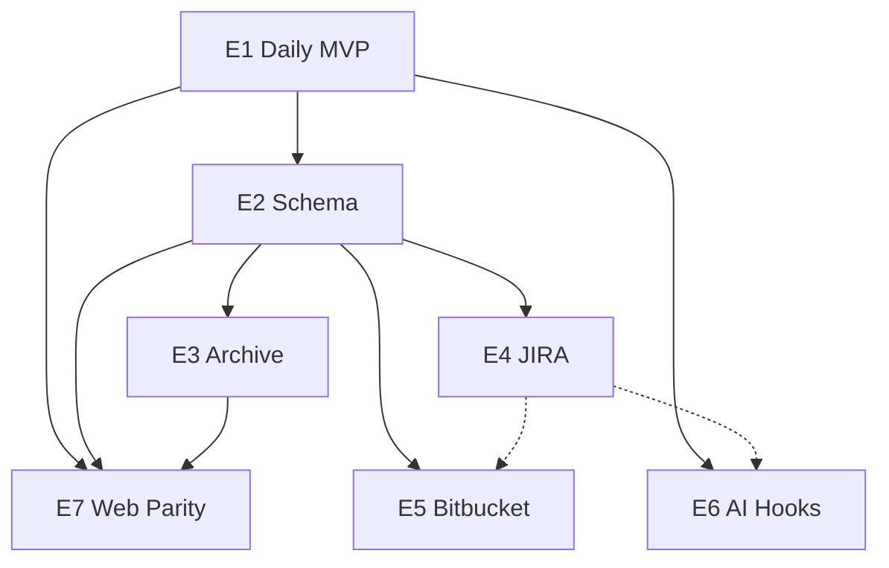

# Epics — Task Timer (TUI-led, full monorepo)

TUI leads UX and schema decisions. Each epic lists **all apps** that must change before the epic is done.

---

## E1 — Daily Timer MVP

**Status:** Done (`feat/tui-mvp`)

**Goal:** Keyboard daily timer sharing SQLite with web.

### Apps

| App | Deliverable |
|-----|-------------|
| TUI | Full daily timer UX |
| Web | `work_date` + `done` migration only |
| MCP | Unchanged (uses existing API) |
| Shared | `timer.ts` reference for Rust port |

### Acceptance criteria

- [x] TUI lists the tasks with a day row on the selected date
- [x] Elapsed while running matches web within 1s
- [x] Day navigation moves the viewed `work_date`
- [x] Continuing on a new day adds that day's row to the same task
- [x] Focus mode stops other tasks same day
- [x] `cargo test -p task-timer-tui` passes
- [x] Export markdown report to clipboard (`x`; matches web/MCP format)
- [x] Merge `feat/tui-mvp` → `main`

---

## E2 — Extended Schema

**Status:** Done (`feat/tui-mvp`) · **Depends on:** E1

**Goal:** Rich tasks, comments, integrations — **one migration, three consumers**.

### Apps

| App | Deliverable |
|-----|-------------|
| Web | Drizzle schema + migration, `taskService`, REST routes, Zod |
| TUI | `db/comments.rs`, `db/integrations.rs`, extended task UI |
| MCP | Extended `create_task`/`update_task`; `add_comment` tool |
| Shared | Updated `Task` / `DatabaseTask` types |

### Acceptance criteria

- [x] Single migration; `pnpm db:migrate` succeeds on existing DB
- [x] Web API CRUD for comments and integrations
- [x] TUI create/edit shows code, notes, tags, status
- [x] TUI status is chosen from `JIRA_STATUSES` and follows the timer (start → In Progress, stop → To Do, done → Done)
- [x] MCP can set extended fields and add comments
- [x] [erd.md](./erd.md) matches deployed schema

---

## E3 — Archive View

**Status:** Done (`main`) · **Depends on:** E2

**Goal:** Every task with the days it was worked and each day's time.

### Apps

| App | Deliverable |
|-----|-------------|
| TUI | Archive screen, filters, "continue today" |
| Web | `GET /api/tasks` (no `date`) — archive with `days[]` and query params |
| MCP | `list_tasks` filter by `done`, `status` |

### Acceptance criteria

- [x] TUI toggles daily ↔ archive
- [x] Archive shows one entry per task, with every day it was worked and that day's time
- [x] Filter by label substring, tag, status, and integration substring
- [x] Continue today resolves the task identity and adds today's day entry

---

## E4 — JIRA Integration

**Status:** Done (`feat/e4-jira`) · **Depends on:** E2

**Goal:** Sprint sync and JIRA mutations from TUI; web/MCP can reuse.

### Existing work

`apps/tui/src/jira.rs` already provides: credential loading (env + `~/.aimsis/jira.env`), issue-key extraction from label/description, and summary fetch + description merge.

### Apps

| App | Deliverable |
|-----|-------------|
| TUI | JIRA sync menu, detail, comment, transition |
| Web | Shared `jira.ts` logic callable from API |
| MCP | `sync_jira_sprint`, `jira_comment`, `jira_transition` (optional) |

### Acceptance criteria

- [x] Credential loading from env vars or `~/.aimsis/jira.env`
- [x] Issue-key extraction from label or description
- [x] Summary fetch merges into task description
- [x] Sprint fetch creates/updates tasks + `task_integrations`
- [x] Comment from TUI appears in JIRA
- [x] Status transition updates JIRA + local task
- [x] Auth failure is non-destructive (toast, not crash)
- [x] `cargo test -p task-timer-tui` passes

---

## E5 — Git / Bitbucket

**Status:** Done (`main`) · **Depends on:** E2, E4 (optional)

**Goal:** Commits and PRs linked to tasks.

### Apps

| App | Deliverable |
|-----|-------------|
| TUI | Branch link, commit list, PR status in detail |
| Web | Shared `bitbucket.ts` logic callable from API |
| MCP | `link_branch`, `fetch_pr_comments` (optional) |

### Acceptance criteria

- [x] Task linked to branch name via `task_integrations` (`group=git, field=branch`)
- [x] Commits listed for branch (git CLI, Ctrl+B → 2)
- [x] PR status visible (Bitbucket API, Ctrl+B → 3)
- [x] PR comments imported into `task_comments`, deduped on `(pr, summary)` (Ctrl+B → 4)
- [x] Commit build/report statuses shown in the detail view (404 → empty, not an error)
- [x] `cargo test -p task-timer-tui` passes
- [x] Tech spec updated

---

## E6 — AI Agent Hooks

**Status:** Done (`main`) · **Depends on:** E1 (E4 for JIRA chain)

**Goal:** Timer follows agent session lifecycle; MCP stays the primary agent API.

### Apps

| App | Deliverable |
|-----|-------------|
| TUI | Hook listener → start/pause/stop |
| MCP | Session tools: `session_start`, `session_pause`, `session_end` mapping to timer |
| Web | `POST /api/session/hook` (Bearer key) for non-MCP agents |
| Repo | `.cursor/hooks.json` + `.codex/hooks.json` with `task-timer-hook` |

### Acceptance criteria

- [x] Documented hook protocol in [tech-spec.md](./tech-spec.md)
- [x] Cursor session start starts timer on selected task
- [x] Waiting for user pauses timer
- [x] Session end stops timer
- [x] MCP tools mirror hook behavior
- [x] Hook failure does not crash TUI or web

---

## E7 — Web Dashboard Parity

**Status:** Done (`main`) · **Depends on:** E1, E2, E3 · **Plan:** [e7-plan.md](./e7-plan.md)

**Goal:** Web dashboard matches TUI daily workflow.

**Known gap, since closed:** the web dashboard writes no task `status` on
start/done, so a task started in the browser keeps its old status while the TUI
would move it to In Progress. Closed by `apps/web/src/lib/server/taskStatus.ts`
(`autoStatus`, a port of the TUI's `auto_status`) — see
[tech-spec.md](./tech-spec.md) E7.

### Tasks

| # | Task | Depends on |
|---|------|-----------|
| 1 | Date navigation (prev/next, `?date=` param) | — |
| 2 | Identity upsert + day-row ensure | — |
| 3 | Extended field UI (code, link, status, notes, tags) | E2 |
| 4 | Archive page with filters + "continue today" | E3 |
| 5 | Fix SSE handler + extend to comments/integrations | — |

### Acceptance criteria

- [x] Dashboard defaults to today; only shows the tasks with a day row on that date
- [x] Date navigation: prev/next day, URL bookmarkable
- [x] Create the same label twice same day → same task and day row, no dupe
- [x] Create the same label on a new day → adds that day's row to the same task
- [x] Extended fields (code, link, status, notes, tags) editable in UI
- [x] Archive view with filter bar (q, tag, status)
- [x] "Continue today" from archive adds today's day entry to the task
- [x] SSE auto-refreshes dashboard on task/comment/integration changes
- [x] Side-by-side: TUI total elapsed = web total elapsed for same day

---

## Dependency graph

```mermaid
graph TD
  E1[E1 Daily MVP]
  E2[E2 Schema]
  E3[E3 Archive]
  E4[E4 JIRA]
  E5[E5 Bitbucket]
  E6[E6 AI Hooks]
  E7[E7 Web Parity]

  E1 --> E2
  E1 --> E6
  E1 --> E7
  E2 --> E3
  E2 --> E4
  E2 --> E5
  E2 --> E7
  E3 --> E7
  E4 -.-> E5
  E4 -.-> E6
```
