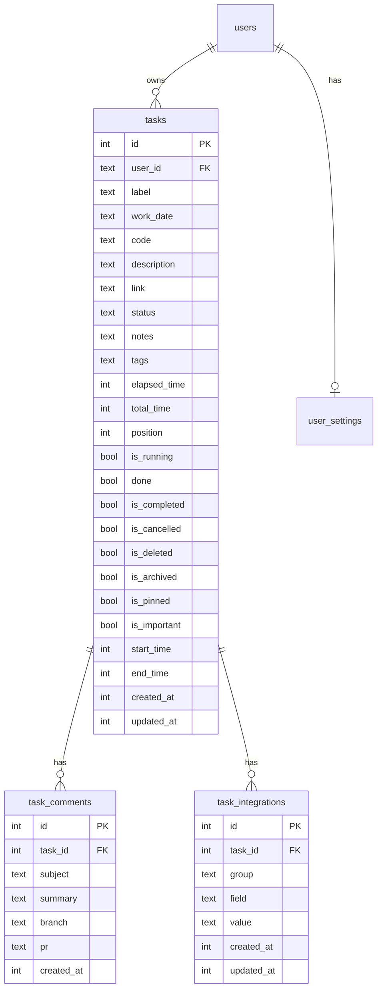
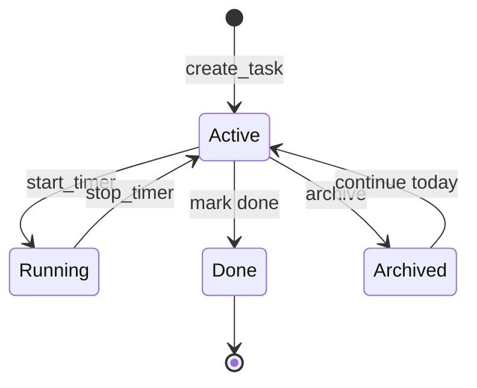

# ERD — Task Timer

**Last updated:** 2026-08-31

## Current schema (E2 implemented)

Source: `apps/web/src/lib/server/db/schema.ts`, migrations `0000`–`0003`.

```mermaid
erDiagram
    users ||--o{ sessions : has
    users ||--o{ tasks : owns
    users ||--o| user_settings : has
    users ||--o{ api_keys : has

    users {
        text id PK
        text email UK
        text password_hash
        int created_at
    }

    sessions {
        text id PK
        text user_id FK
        int expires_at
    }

    tasks {
        int id PK
        text user_id FK
        text label
        text work_date
        text description
        int elapsed_time
        int position
        bool is_running
        bool done
        int start_time
        int created_at
        int updated_at
    }

    user_settings {
        text user_id PK_FK
        text timer_mode
        int updated_at
    }

    api_keys {
        text id PK
        text user_id FK
        text key_hash UK
        text key_prefix
        text name
        json scopes
        bool revoked
        int last_used_at
        int created_at
    }
```

### Indexes (tasks)

| Index | Columns |
|-------|---------|
| `idx_tasks_user` | `user_id` |
| `idx_tasks_position` | `user_id`, `position` |
| `idx_tasks_user_date` | `user_id`, `work_date` |
| `idx_tasks_user_date_label` | `user_id`, `work_date`, `label` (unique) |

### Notes

- `work_date`: ISO date string `YYYY-MM-DD`, default `date('now')`
- `elapsed_time`: seconds (integer)
- `start_time`: epoch ms when timer started; null when stopped
- `timer_mode`: `'focus'` \| `'parallel'`

---

## Target schema (E2+)

Planned from [prd.md](./prd.md) / [IDEA.md](../../apps/tui/IDEA.md).



### `task_integrations` examples

| group | field | value |
|-------|-------|-------|
| jira | issue_key | AIMSIS-1234 |
| jira | status | "In Progress" |
| gcp | error_group | projects/.../groups/... |
| bitbucket | pr_id | 42 |

### `tags` storage (TBD)

- JSON text column on `tasks` is used for E2 (simplest).

---

## Entity lifecycle



Daily scope: each `(user_id, work_date, label)` is one row. "Continue" on a new day creates a **new** row with copied description.

---

## Migration path

| Step | Migration | Epic |
|------|-----------|------|
| Base tables | `0000_common_leopardon.sql` | pre-TUI |
| `done` column | `0001_shocking_madrox.sql` | pre-TUI |
| `work_date` + indexes | `0002_chubby_roulette.sql` | E1 |
| Extended columns + new tables | `0003_flat_layla_miller.sql` | E2 |

**Rule:** all migrations live in `apps/web/drizzle/`. TUI never owns migrations.

---

## Cross-app sync matrix

When E2 lands, update all consumers in one PR:

| Table/column | Web schema | taskService | REST | MCP | TUI db |
|--------------|------------|-------------|------|-----|--------|
| tasks.* | ✓ | ✓ | ✓ | ✓ | ✓ |
| task_comments | ✓ | ✓ | ✓ | ✓ | ✓ |
| task_integrations | ✓ | ✓ | ✓ | optional | ✓ |

See [tasks.md](./tasks.md) E2 checklist.
