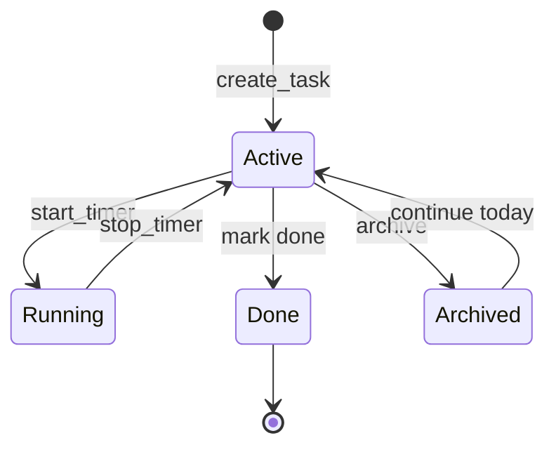

# ERD — Task Timer

**Last updated:** 2026-09-21

## Current schema (E2 implemented, identity/day split landed)

Source: `apps/web/src/lib/server/db/schema.ts`, migrations `0000`–`0004`.

```mermaid
erDiagram
    users ||--o{ sessions : has
    users ||--o{ tasks : owns
    users ||--o| user_settings : has
    users ||--o{ api_keys : has
    tasks ||--o{ task_days : has
    tasks ||--o{ task_comments : has
    tasks ||--o{ task_integrations : has

    users {
        text id PK
        text email UK
        text password_hash
        int created_at
    }

    sessions {
        text id PK
        text user_id FK
        int expires_at
    }

    tasks {
        int id PK
        text user_id FK
        text label
        text code
        text description
        text link
        text notes
        text tags
        int created_at
        int updated_at
    }

    task_days {
        int id PK
        int task_id FK
        text work_date
        text status
        int elapsed_time
        int total_time
        int position
        bool is_running
        bool done
        bool is_completed
        bool is_cancelled
        bool is_deleted
        bool is_archived
        bool is_pinned
        bool is_important
        int start_time
        int end_time
        int created_at
        int updated_at
    }

    task_comments {
        int id PK
        int task_id FK
        text subject
        text summary
        text branch
        text pr
        int created_at
    }

    task_integrations {
        int id PK
        int task_id FK
        text group
        text field
        text value
        int created_at
        int updated_at
    }

    user_settings {
        text user_id PK_FK
        text timer_mode
        int updated_at
    }

    api_keys {
        text id PK
        text user_id FK
        text key_hash UK
        text key_prefix
        text name
        json scopes
        bool revoked
        int last_used_at
        int created_at
    }
```

### Indexes

| Index | Table | Columns |
|-------|-------|---------|
| `idx_tasks_user` | `tasks` | `user_id` |
| `idx_tasks_user_label` | `tasks` | `user_id`, `label` (unique) |
| `idx_task_days_task` | `task_days` | `task_id` |
| `idx_task_days_date_position` | `task_days` | `work_date`, `position` |
| `idx_task_days_date` | `task_days` | `work_date` |
| `idx_task_days_task_date` | `task_days` | `task_id`, `work_date` (unique) |

### Notes

- `work_date`: ISO date string `YYYY-MM-DD`, default `date('now')` — on `task_days`
- `elapsed_time`: seconds (integer) — on `task_days`
- `position`: per **day across tasks** (it orders that day's list), not per task
- `start_time`: epoch ms when timer started; null when stopped
- `status`, `done`, and the flags are all **per day**, on `task_days`
- `task_comments` / `task_integrations` FK to the task identity, so they are no longer duplicated per day
- `timer_mode`: `'focus'` \| `'parallel'`

---

## `task_integrations` examples

| group | field | value | written by |
|-------|-------|-------|------------|
| jira | issue_key | AIMSIS-1234 | TUI sprint sync / fetch-by-key |
| jira | status | "In Progress" | TUI sprint sync (what JIRA reported) |
| gcp | error_group | projects/.../groups/... | — |
| bitbucket | pr_id | 42 | — |
| git | branch | US-1459-fix | TUI git menu (`Ctrl+B`) |
| agent | status | running | sprint orchestrator |
| agent | session | 79ddc960-… | sprint orchestrator |
| agent | attention | true | sprint orchestrator |

`jira/issue_key` and `jira/status` are both written by the TUI's sprint sync and
fetch-by-key ingest. `jira/status` holds the status JIRA reported for the issue,
not the task's own `status` column — that one follows the timer (`auto_status`).

The `agent` group records what an agent is doing on the ticket, so the daily list
can badge it (`apps/tui/README.md` § Agent badge). All three fields are written by
`~/.agents/scripts/orchestrator_run.py` through `task-timer-tui integration set`:

- `status` — Paseo's own word (`running`, `idle`, `closed`, `failed`), stored
  verbatim rather than translated.
- `session` — the Paseo agent id, so a row can be traced back to `paseo inspect`.
- `attention` — `true` when Paseo reports `requiresAttention`; written only when
  known, so an update that lacks it leaves the previous value alone.

Rows are keyed by `(task_id, group, field)`, so a writer updates in place rather
than appending. Nothing outside the orchestrator writes the `agent` group, and the
orchestrator writes no other group — that is the whole contract.

`agent/*` is also writable through the existing REST route
(`PATCH /api/tasks/:id/integrations`, `docs/api.md`), but the orchestrator does not
use it: the write goes through the TUI CLI so the timer stays the schema owner and
no web server has to be running. One consequence is worth knowing: the CLI writes
SQLite directly, so the web dashboard does **not** get an SSE `integration` event
for these rows and picks them up on its next visibility refresh. The TUI, which
reloads every second, is the live surface for agent state.

### `tags` storage

A JSON text column on `tasks`, as E2 shipped. Not a join table.

---

## Entity lifecycle

```mermaid
stateDiagram-v2
    [*] --> Active: create_task
    Active --> Running: start_timer
    Running --> Active: stop_timer
    Active --> Done: mark done
    Active --> Archived: archive
    Done --> [*]
    Archived --> Active: continue today
```

The day row's `status` column tracks this independently of the `done` flag: the
TUI and CLI write `21` on start, `11` on stop/reset, `31` on done, and `11` on
un-done. The web dashboard writes the same values via `autoStatus` — see
[tech-spec.md](./tech-spec.md) E7. A day already checked done keeps `Done`
through a stop.

Lifecycle states are **per day**: the diagram describes one `task_days` row.
`Archived --> Active: continue today` means starting the task on a new day, which
creates **that day's row on the SAME task** — the identity is never re-created.

Daily scope: one task identity per `(user_id, label)`, and one `task_days` row per
day that task was worked. Continuing on a new day creates that day's row on the
same task; the identity's label/description are shared across all its days.

---

## Migration path

| Step | Migration | Epic |
|------|-----------|------|
| Base tables | `0000_common_leopardon.sql` | pre-TUI |
| `done` column | `0001_shocking_madrox.sql` | pre-TUI |
| `work_date` + indexes | `0002_chubby_roulette.sql` | E1 |
| Extended columns + new tables | `0003_flat_layla_miller.sql` | E2 |
| Identity/day split (`tasks` + `task_days`) | `0004_superb_tag.sql` | day-identity split |

**Rule:** all migrations live in `apps/web/drizzle/`. TUI never owns migrations.

---

## Cross-app sync matrix

E2 landed: every consumer reads and writes these tables today. Keep this matrix
as the checklist for the next schema change — a new column must land in all five
places in one PR.

| Table/column | Web schema | taskService | REST | MCP | TUI db |
|--------------|------------|-------------|------|-----|--------|
| tasks.* (identity) | ✓ | ✓ | ✓ | ✓ | ✓ |
| task_days.* (per day) | ✓ | ✓ | ✓ | ✓ | ✓ |
| task_comments | ✓ | ✓ | ✓ | ✓ | ✓ (list/add) |
| task_integrations | ✓ | ✓ | ✓ | optional | ✓ (read/write) |

`task_comments` and `task_integrations` FK to the task identity, so neither is
duplicated per day. See [tasks.md](./tasks.md) E2 checklist.
