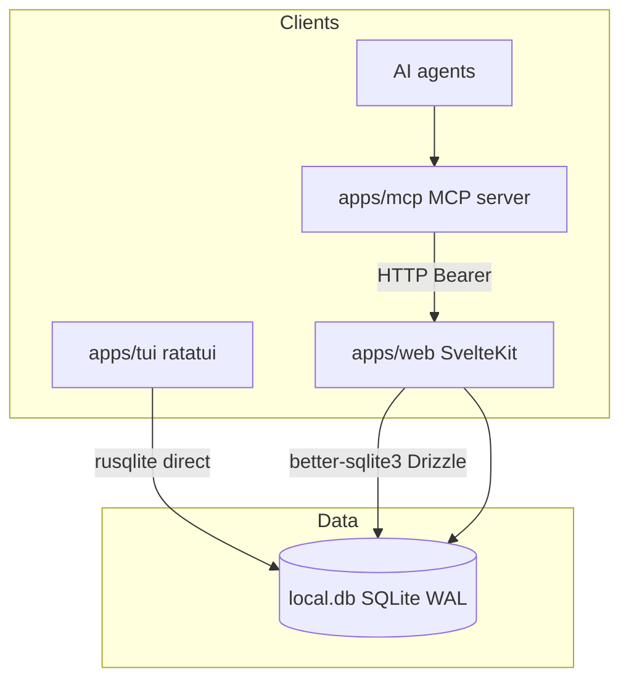

# Tech Spec — Task Timer TUI (monorepo)

**Last updated:** 2026-09-10

## System context



- **TUI** reads/writes DB directly — no web server required.
- **Web** owns migrations (Drizzle in `apps/web/drizzle/`).
- **MCP** is a thin HTTP client to web REST API — never touches DB directly.
- **Timer rules** must match in three places: `packages/shared/src/timer.ts`, `apps/web/src/lib/server/taskService.ts`, `apps/tui/src/timer.rs` + `db/tasks.rs`.

## TUI crate layout

```text
Cargo.toml                         # workspace members = ["apps/tui"]
apps/tui/
  Cargo.toml
  src/
    main.rs                        # CLI: --config, --date, --db
    config.rs                      # ~/.config/task-timer-tui/config.toml
    timer.rs                       # current_elapsed_seconds, format_time
    db/
      mod.rs                       # Connection, WAL pragmas
      user.rs                      # user_id from email
      tasks.rs                     # CRUD + timer ops
      comments.rs                  # E2
      integrations.rs              # E2
    app/
      mod.rs                       # Event loop, App state, modals
      keymap.rs                    # Bindings + HELP text
    ui/
      mod.rs
      timer_view.rs                # Daily layout
      archive_view.rs              # E3
      widgets.rs
    jira.rs                      # E4 — direct JIRA REST API
    bitbucket.rs                  # E5 — Bitbucket REST API
    git.rs                        # E5 — git CLI wrapper
    hooks/
      mod.rs                         # E6 — hook event types + UDS listener
```

### Dependencies

`ratatui`, `crossterm`, `rusqlite` (bundled), `chrono`, `serde`, `toml`, `anyhow`, `directories`

## Config

```toml
# ~/.config/task-timer-tui/config.toml
database_path = "/path/to/apps/web/local.db"
user_email = "you@example.com"
# timer_mode = "focus"   # optional; else user_settings.timer_mode
# JIRA (E4) — env vars: JIRA_SITE, JIRA_EMAIL, JIRA_TOKEN
# jira_board = "AIMSIS"
# jira_sprint_id = "123"
# Bitbucket (E5) — env vars: BITBUCKET_EMAIL, BITBUCKET_TOKEN
# bitbucket_workspace = "your-workspace"
# bitbucket_repo = "your-repo"
# git_repo_path = "/path/to/repo"  # auto-detected from database_path if omitted
```

CLI overrides: `task-timer-tui --date YYYY-MM-DD --db PATH --config PATH`

User must exist in `users` (register via web). No password in TUI for MVP.

## Domain logic (E1 — implemented)

Ported from `taskService.ts`:

| Function | Behavior |
|----------|----------|
| `current_elapsed_seconds` | `elapsed + floor((now - start_time)/1000)` if running |
| `list_tasks` | `WHERE user_id AND work_date ORDER BY position` |
| `create_task` | Dedup same day; else insert, copy description from latest same label |
| `start_timer` | Focus: stop others same day; set `is_running`, `start_time` |
| `stop_timer` | Accumulate elapsed, clear `start_time`, `is_running = false` |
| `reset_task` / `reset_all` | Zero elapsed for day |
| `update_task` / `delete_task` / `reorder_tasks` | Standard SQL |

Timestamps: epoch **milliseconds** (match Drizzle `timestamp_ms`).

## Concurrency

- SQLite WAL enabled (web `db/index.ts`; TUI sets same pragmas).
- Web + TUI concurrent access: **last write wins** on conflict.
- TUI reloads on each action + 1s tick when any timer running.
- Document: avoid heavy web edits during TUI session without refresh.

## Web API touchpoints (E2+)

New routes should mirror TUI capabilities:

| Endpoint | Purpose |
|----------|---------|
| `GET/POST /api/tasks/[id]/comments` | E2 |
| `GET/PATCH /api/tasks/[id]/integrations` | E2 |
| `GET /api/tasks/archive` | E3 |
| `POST /api/jira/sync` | E4 |
| `POST /api/session/hook` | E6 |

Update `docs/api.md` when each ships.

## MCP touchpoints (E2, E4, E6)

`apps/mcp/src/server.ts` registers tools → HTTP to web API.

| Epic | Tools to add/extend |
|------|---------------------|
| E2 | `add_comment`; extend `create_task`, `update_task` |
| E4 | `sync_jira_sprint`, `jira_comment`, `jira_transition` |
| E6 | `session_start`, `session_pause`, `session_end` |

Keep MCP thin — no business logic duplication; web `taskService` stays canonical for HTTP path.

## E6 — Hook protocol (implemented)

Agent session lifecycle hooks. Timer follows agent start/pause/end.

### Transport

Unix domain socket: `~/.cache/task-timer-tui/hook.sock`

JSON lines protocol — one JSON object per line:

```json
{"event":"session_start","task_id":42}
{"event":"waiting_user"}
{"event":"session_end"}
```

| Event | TUI action | MCP tool | Web endpoint |
|-------|------------|----------|--------------|
| `session_start` | `start_timer(task_id)` or selected task if no `task_id` | `session_start` | `POST /api/session/hook` |
| `waiting_user` | `stop_timer` on all running | `session_pause` | `POST /api/session/hook` |
| `session_end` | `stop_timer` on all running today | `session_end` | `POST /api/session/hook` |

### Hook script

`scripts/task-timer-hook` — Python3 script, no external deps:

```bash
task-timer-hook session_start [TASK_ID]
task-timer-hook waiting_user
task-timer-hook session_end
```

Silent exit if TUI not running (socket missing). Never crashes agent hooks.

### Agent integration

- **Cursor** (`.cursor/hooks.json`): `SessionStart` → `task-timer-hook session_start`; `SessionEnd` → `task-timer-hook session_end`
- **Codex** (`.codex/hooks.json`): same pattern
- **MCP agents**: use `session_start`, `session_pause`, `session_end` tools (thin wrappers over `POST /api/session/hook`)
- **External agents**: `POST /api/session/hook` with Bearer API key

### Web endpoint

`POST /api/session/hook` — Bearer-authenticated, requires `tasks:write` scope.

```json
{"event":"session_start","task_id":42}
{"event":"waiting_user"}
{"event":"session_end"}
```

### TUI implementation

`apps/tui/src/hooks/mod.rs` — non-blocking UDS listener polled every 250ms in the event loop.

- `HookEvent` enum with serde tag deserialization
- `HookListener` wraps `std::os::unix::net::UnixListener` (no extra deps)
- Stale socket cleanup on startup and drop
- Errors logged as status messages, never crash TUI

## E4 — JIRA Integration (implemented)

Chose option A: standalone `reqwest` calls from TUI. No web server dependency.

| Function | Purpose |
|----------|---------|
| `jira_fetch` | GET issue — summary, description, status |
| `issue_key_from_task` | Parse `AIM-NNNN` from label/description |
| `description_for_task` | Fetch summary + status for task description field |
| `post_comment` | POST comment on issue |
| `get_transitions` | GET available workflow transitions |
| `transition_issue` | POST transition to move issue status |
| `pick_transition_id` | Match status name to transition |
| `fetch_sprint_issues` | GET all issues in a sprint (board + sprint ID) |

**TUI controls:** Ctrl+J opens JIRA menu → comment (1), transition (2), sprint sync (3).
Credentials via env vars (`JIRA_SITE`, `JIRA_EMAIL`, `JIRA_TOKEN`).
Board/sprint config in `config.toml` (`jira_board`, `jira_sprint_id`).

## E5 — Git / Bitbucket Integration (implemented)

Hybrid approach: local git CLI for branch/commit info, Bitbucket REST API for PR status.

| Function | Purpose |
|----------|---------|
| `git::current_branch` | Get current branch via `git rev-parse` |
| `git::commits_for_branch` | List recent commits on a branch |
| `git::branch_ahead_behind` | Ahead/behind count vs upstream or main |
| `bitbucket::bb_fetch` | Shared Bitbucket REST API fetcher |
| `bitbucket::list_prs` | List PRs for a branch |
| `bitbucket::get_pr_status` | Get PR status by ID |
| `bitbucket::get_pr_comments` | Get PR comments |

**TUI controls:** Ctrl+B opens Git menu → link branch (1), show commits (2), PR status (3).
Credentials via env vars (`BITBUCKET_EMAIL`, `BITBUCKET_TOKEN`).
Workspace/repo in `config.toml` (`bitbucket_workspace`, `bitbucket_repo`).
Repo path auto-detected from `database_path` or set via `git_repo_path`.
Branch linked via `task_integrations` (`group=git, field=branch`).

## E7 — Web dashboard parity

Plan: [e7-plan.md](./e7-plan.md). TUI remains the reference; web catches up.

| Already in web | Still to do |
|----------------|-------------|
| `?date=` load + date bar | `createTask` TUI dedup + optional `workDate` |
| `GET /api/tasks?archived=` | `/dashboard/archive` UI + continue today |
| PATCH extended fields | edit modal + card badges |
| SSE `{ type: 'change' }` publish | client still listens for `tasks-changed` (never fires) |

Timer math stays in `packages/shared` + `taskService`. Do not re-filter `work_date` client-side.

## Testing

| Layer | Command |
|-------|---------|
| TUI unit | `cargo test -p task-timer-tui` |
| Web unit | `pnpm --filter sv-task-timer test` (Vitest; add in E7 Wave 1) |
| Web types | `pnpm --filter sv-task-timer check` |
| MCP | manual tool invocation against dev server |
| Cross-app | checklist in [tasks.md](./tasks.md) E7 verification |

## Verification (E1)

1. `pnpm --filter sv-task-timer db:migrate`
2. Register user; create tasks via web
3. `pnpm dev:tui` — start/stop; compare elapsed to web
4. Change day; create same label; verify description copy
5. Focus mode: start B while A running → A stops

## References

- Cursor plan: `TUI Timer MVP-6105cd28` (content merged here)
- `apps/web/src/lib/server/db/index.ts` — WAL setup
- `docs/ai-control.md` — MCP architecture
- `docs/api.md` — REST reference
